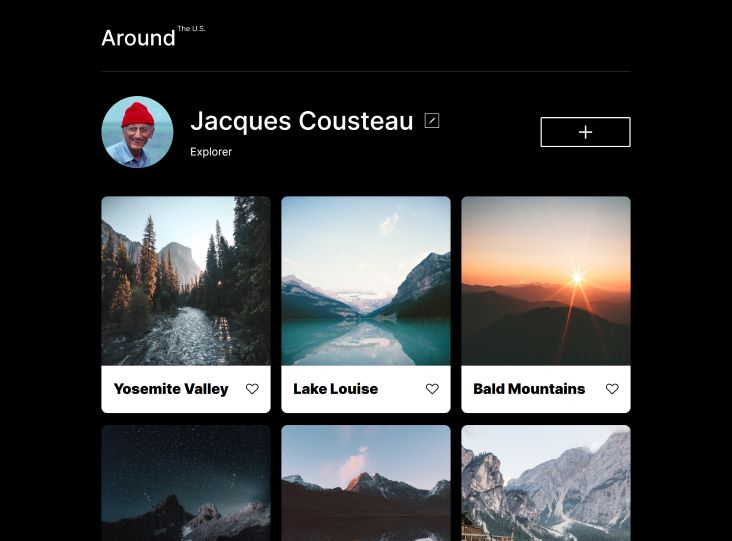
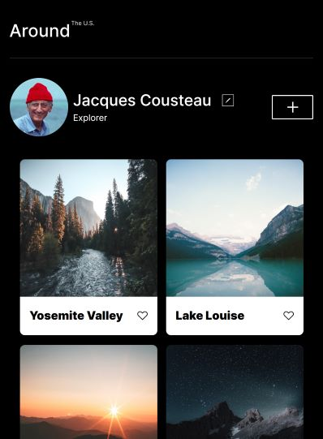

# Project 3: Around The U.S.

## Intro

This project is made so all the elements are displayed correctly on popular screen sizes, in other words, a responsive website.

Using relative units of measurement, writing separate CSS rules for common screen sizes, like desktop, tablet, and mobile, and deciding when to hide or show an element and make it visible, we were able to adjust the website to different screen sizes.

This site lets you add photos and share them with the world, and with a profile section, you can let people know it was you who took them.

## Project Features

- Semantic HTML5
- Responsive Webpage
- Flexbox
- Grid
- Media Queries

```css
@media screen and (max-width: 770px) {
  .profile__info {
    grid-template-columns: minmax(auto, 300px) auto;
    grid-gap: 6px 6px;
  }
  ...
@media screen and (max-width: 580px) {
  .profile__info {
    grid-template-columns: minmax(auto, 240px) auto;
    grid-gap: 5px 5px;
  }
  ...
  @media screen and (max-width: 486px) {
  .profile {
    display: flex;
    flex-direction: column;
    text-align: center;
    padding: 40px 0 28px;
  }
  ...
```

  
 

[Project GitHub Page](https://jbr4ndt.github.io/se_project_aroundtheus/)
